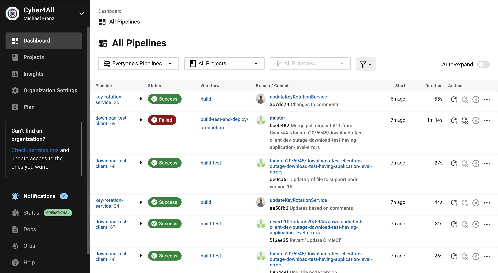
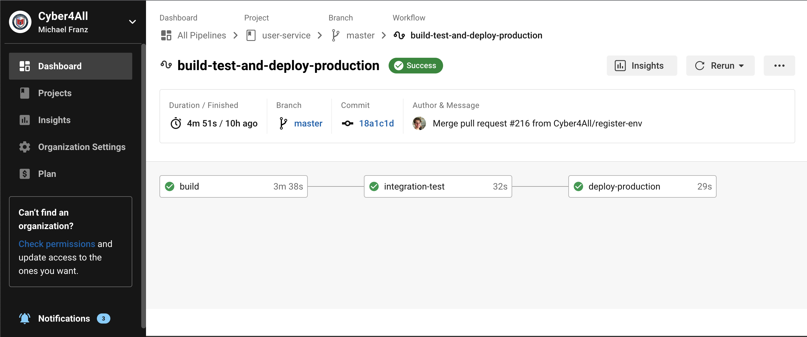
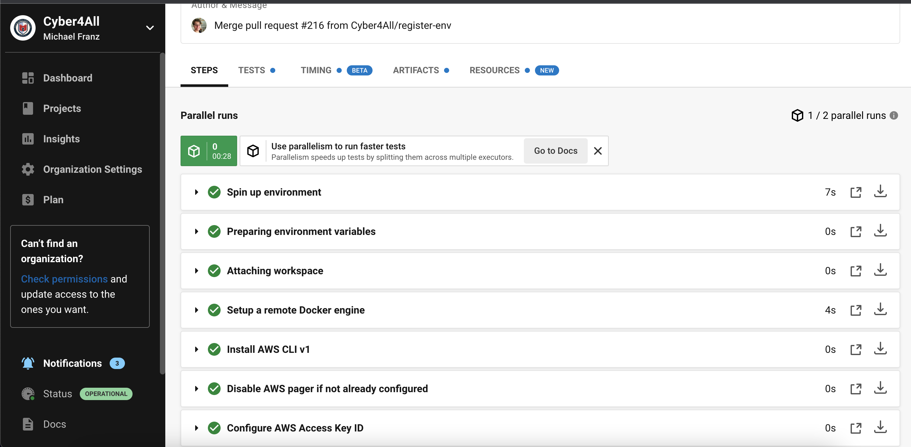

# CircleCI

# Dates: January 28, 2022

# Instructor: Christopher Wagner

## What is CircleCI?

CI/CD stands for Continuous Integration, Continuous Deployment

Continuous integration is a practice that encourages developers to integrate their code into a main branch of a shared repository early and often. Instead of building out features in isolation and integrating them at the end of a development cycle, code is integrated with the shared repository by each developer multiple times throughout the day

Continuous deployment is a software release process that uses automated testing to validate if changes to a codebase are correct and stable for immediate autonomous deployment to a production environment

CircleCI allows for CI/CD. A repository is set up as a project and each project contain pipelines that execute tests to ensure that new changes that were just committed on a branch do not break the current branch. If tests fail, the developer is notified so that they may be able to look at the logs and make the necessary changes

[About CircleCI](https://circleci.com/docs/2.0/about-circleci/)

## CircleCI Console


The CircleCi Console allows easy access to the projects you work on. The left navigation panel allows you to toggle between the different 
organizations that you may have assocaited with your circle account. The dashboard displays all pipelines that you follow and allows you 
to filter certain projects, pipelines, and even specific branches. The projects page allows you to control which software pipelines you
want to follow. Here is were you will configure your projects repo with circle. 

From the dashboard, you can view the pipelines integration and deploymnet by clicking on the status of the pipeline.



You can expand each job to see what is being executed as well as any errors that occured.


## CircleCI Concepts

### Projects
Shares the same name as the code repository it is configured to automate workflows, tests, and deployments for.

Settings and configurations for CircleCI projects can be configured to use specific settings, contexts, and environment variables for the CI/CD pipeline it uses

### Configuration
CircleCI is rooted in the principle of 'configuration as code'. The CI/CD process is executed through a [config.yml](#configyml). The *config.yml* 
file is located in a folder called *.circleci* at the root of our projects. The YAML syntax is what Circle uses for its configuration. 
This YAML file is what defines each pipeline entirely with [commands](#commands), [jobs](#jobs), [executors](#executors), and [workflows](#workflows).

### User Types

There are different user types that exist in CircleCi, each have their own permissions within the organization:

| User Type | Description | Example Permissions |
| --- | --- | --- |
| Organization Admin | The GitHub organization owner | Restricting contexts to a security group |
| Project Admin | The user who adds a repository to CircleCI | - |
| User | A user under an organization | Access executed pipelines and workflows |
| CircleCI User | Anyone who can log into CircleCI | Change user settings |

References:
- [Project Administrator](https://circleci.com/docs/2.0/glossary/#project-administrator)
- [User](https://circleci.com/docs/2.0/glossary/#user)

### Pipelines
Pipelines are the highest-level unit of work that includes the entire `.circleci/config.yml` file. Pipelines have workflows which coordinate jobs and they have a fixed, linear lifecycle and are associated with a specific actor. There are multiple ways to trigger a pipeline including a push to a project, a scheduled task, or manually through the CircleCI app. 

## Config.yml

### YAML Syntax
YAML is a human-friendly data serialization standard for all programming languages. It is a strict superset of JSON, which means it can do everything that JSON can and more! 

#### Basic Structure 
A YAML file is just a hash map that consists of one or more key-value pairs that can be nested.
```yaml
  key: value
  key: 
    nested_key: "yeet a value in here"
```

##### Multi-line string
```yaml
  multi: >
    I am on multiple
    lines bruh
```

##### Sequences
```yaml
  star_wars:
    - episode_4: "The real first episode"
    - episode_5
    - episode_6
    - episode_1:
        a_fake_first: true
    - episode_2
    - episode_3
```
##### Anchors and Aliases 
To simplify a `config.yaml` anchors identified by the & character and aliases identified by the * can be used to identify values. 
```yaml
  character:
    - &name Darth Vadar
    - &age 63
    - &hobbies Taking over the galaxy
    - *name
    - *age
    - *hobbies
``` 
The output of this would be:
```yaml
  character:
    - Darth Vadar
    - 63
    - Taking over the galaxy
``` 

##### Further Examples
CircleCI[Configuring CircleCI](https://circleci.com/docs/2.0/configuration-reference/)

### Orbs

Orbs are reusable snippets of code that help automate repeated processes, accelerate project setup, and make it easy to integrate with third-party tools such as Node, Docker, and AWS. 

To invoke an orb:

```yaml
  version: 2.1

  orb:
    maven: circleci/maven@0.0.12
  
  workflows:
    maven_test:
      jobs:
        - maven/test
```

In this case, ``` maven: circleci/maven@0.0.12 ```, maven can be thought as the object reference variable and is used in the workflow named ``` maven_test ``` 

You can create your own orb and use them within your organization only or post it on the circleci orb registry.

SecurEd will be creating their own orb to make our config.yml shorter and abstract many jobs and commands to a single repository.

Resources:

[Orb Documentation](https://circleci.com/docs/2.0/concepts/#orbs) <br>
[Orb Introduction](https://circleci.com/docs/2.0/orb-intro/) <br>
[Authoring Orbs](https://circleci.com/docs/2.0/orb-author-intro/)

### Commands

Used in tandem with Jobs and Steps to execute specific actions for a particular job or step

Commands can be named so that they can be reused in the CircleCI config.yml

### Executors

An executor is an execution environment in CircleCI.  It defines the underlying technology or environment to run the job on.  For instance, using docker, machine (Linux VM), MacOS, or Windows to run commands.

For SecurEd Inc., we primarily use the docker executors.  For older services (such as learning object service), we have built our own images for executors: [cyber4all/circleci-aws](https://hub.docker.com/r/cyber4all/circleci-aws).

References:
- [CircleCI Docs - Executor Intro](https://circleci.com/docs/2.0/executor-intro/)

### Jobs
Jobs are collections of steps. All of the steps in the job are executed in a single unit, either within a fresh container 
or VM. Jobs can be run using *machine* or *docker* executors, which can compose Docker containers to run a job(s) and any service(s) they require

The example below is what is actually being used by clark-client. We have a build job and a publish-image job.
The build will build the angular application and persist the working directory to the workspace to be used.
The publish image job will push the new docker image to dockerhub

```yaml
...
jobs:
  build:
    docker:
      - image: cimg/node:16.13.2
    steps:
      - checkout
      - run:
          name: Install Dependencies
          command: npm install
      - run:
          name: Build Application
          command: yarn ng build --configuration production --no-progress
      - persist_to_workspace: 
          root: dist
          paths: 
            - ./

  publish-image:
    docker:
      - image: cimg/node:16.13.2
    steps:
      - checkout
      - setup_remote_docker:
          version: 20.10.2
      - run:
          name: Login to docker
          command: docker login -u "${DOCKER_USERNAME}" -p "${DOCKER_PASSWORD}"
      - docker/build:
          image: "cyber4all/clark-client"
      - docker/push:
          image: "cyber4all/clark-client"
```
### Workflows

Workflows define a list of jobs and their run order. It is possible to run jobs concurrently, sequentially, on a schedule, or with a manual gate using an approval job

```yaml
  ...
  workflows:
    build_and_test: # naming the workflow
      jobs: # tasks that the workflow will execute
        # Theses jobs would be created and defined somewhere else in the config.yml file
        - build1 
        - build2:
          requires: # Build2 job does not start until build1 finishes
            - build1
        - build3:
          requires: # Build3 job doesenot start until build1 finishes
            - build1
        # Build2 and build3 will run concurrently
```

[Workflows](https://circleci.com/docs/2.0/concepts/#workflows)

## Demo Example

```YAML
version: 2.1

executors:
  go-exec:
    docker:
      - image: cimg/base:2022.01
    working_directory: ~/test-app

  test-exec:
    docker:
      - image: cimg/node:17.0.1
    working_directory: ~/test-app

orbs:
  node: circleci/node@5.0.0
  docker: circleci/docker@2.0.1
  aws-cli: circleci/aws-cli@2.0.3

commands:
  docker-setup:
    description: "Installs and logs into docker"
    parameters:
      job: 
        default: ""
        description: |
          "Job command is being run from"
        type: string
    steps:
      - setup_remote_docker
      - docker/install-docker
      - run: 
          command: | # verifying and using parameters
            if [ "<<parameters.job" = "" ]; then
              echo "Param not set"
              circleci-agent step halt
            fi
            echo "Command run from <<parameters.job>>"
      - run:
        name: Docker login 
        command: docker login -u "${DOCKER_USERNAME}" -p "${DOCKER_PASSWORD}" # using context variables

jobs:
  endpoint-testing:
    executor: test-exec
    steps:
      - checkout # checks out source code to path (working_directory)
      - node/install-packages # using an orb's command
      - run:
          command: npm run test # run endpoints with npm

  app-build:
    executor: go-exec
    steps:
      - checkout
      - docker-setup # using a command
      - docker/build: 
          image: "cyber4all/test-app" # default tag is $CIRCLE_SHA1
      - run:
          name: Save docker build
          command: docker save -o "dockerbuild" "cyber4all/test-app:$CIRCLE_SHA1" # saves build image as a .tar
      - persist_to_workspace: # workspaces are created for each workflow where data can be saved and loaded
          root: . # relative path to workspace
          paths:
            - dockerbuild # files being attached

  deploy-app:
    executor: go-exec
    steps: 
      - checkout
      - docker-setup
      - aws-cli/install
      - aws-cli/setup:
          aws-access-key-id: AWS_ECS_AccessKey # passing context variables as parameters for orb command
          aws-region: AWS_REGION_N_VA
          aws-secret-access-key: AWS_ECS_SecretKey
          version: "1"
      - attach_workspace: # loads workspace data (.tar file from app-build)
          at: ~/test-app/
      - run:
          name: Load docker build
          command: docker load -i "dockerbuild"
      - run:
          name: Check unique tag
          command: | # verify using curl request
            if curl --silent -f -lSL "https://index.docker.io/v1/repositories/cyber4all/test-app/tags/$(./version.sh -r)" > /dev/null; then
              echo "$(./version.sh -r) already exists in dockerhub"
              circleci-agent step halt
              exit 1
            fi
      - run: docker tag "cyber4all/test-app:$CIRCLE_SHA1" "cyber4all/test-app:$(./version.sh -r)"
      - docker/push:
          image: "cyber4all/test-app"
          tag: "$(version.sh -r)"
      - run:
          name: "Deploy to ECS"
          command: |
            NEW_TASK=$(aws ecs describe-task-definition --region us-east-1 --task-definition 'test-app' --output json | jq --arg IMG "cyber4all/test-app:$(version.sh -r)" '.taskDefinition.containerDefinitions[0].image=$IMG')
            aws ecs register-task-definition \
                --family 'test-app' \
                --task-role-arn ecsTaskExecutionRole \
                --execution-role-arn ecsTaskExecutionRole \
                --network-mode 'awsvpc' \
                --cli-input-json "$(echo $NEW_TASK)"

workflows:
  testing:
    - docker/hadolint:
        dockerfiles: Dockerfile:Dockerfile.dev
        executor-class: medium
        filters:
          branches:
            ignore:
              - /main/
              - /hotfix/
              - /releases/
    - endpoint-testing:
        filters:
          branches:
            ignore:
              - /releases/

  deploying:
    - app-build:
        context:
          - DockerHub
        requires:
          - docker/hadolint
          - endpoint-testing
        filters:
          branches:
            only:
              - /releases/
    - deploy-app:
        context:
          - AWS
          - DockerHub
        requires:
          - app-build
        filters:
          branches:
            only:
              - /releases/
```